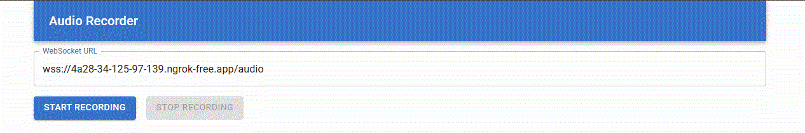

# Realtime Speech Transcriber

> 실시간 음성을 텍스트로 변환하는 웹 애플리케이션입니다.  
> Google Colab + Flask + React + OpenAI Whisper 기반으로 구현되었습니다.

---

## 시연 이미지

  

---

## 실행 파일 다운로드

[📥 다운로드](https://github.com/yangjunsik/realtime-speech-transcriber/releases/latest/download/Audio.Recorder.zip)

---

## 기술 스택

- **백엔드**: Python, Flask, flask-cors, flask-sock  
- **프론트엔드**: HTML, React (via Babel), Material UI  
- **음성 인식**: OpenAI Whisper  
- **배포 환경**: Google Colab + pyngrok

---

## 학습한 기술 요약

- Flask + WebSocket을 통한 실시간 스트리밍 처리
- Whisper 모델을 활용한 고정밀 음성 인식
- ngrok을 이용한 외부 접속 테스트 환경 구성
- React 기반 UI 및 실시간 결과 표시 처리

---
